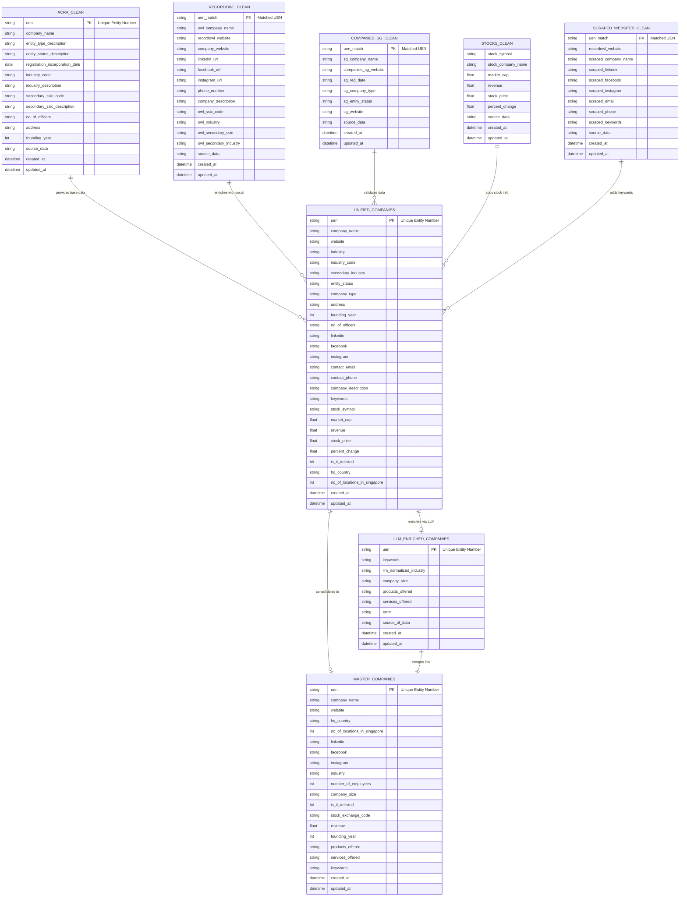

# 📊 Singapore Company Intelligence Data Pipeline - Complete Documentation

<details>
  <summary>Table of Contents</summary>
  <ol>
    <li>
      <a href="#-project-overview">🎯 Project Overview</a>
      <ul>
        <li><a href="#key-objectives">Key Objectives</a></li>
      </ul>
    </li>
    <li>
      <a href="#%EF%B8%8F-architecture">🏗️ Architecture</a>
      <ul>
        <li><a href="#medallion-architecture-layers">Medallion Architecture Layers</a></li>
        <li><a href="#technology-stack">Technology Stack</a></li>
      </ul>
    </li>
    <li>
      <a href="#-data-sources">🧱 Data Sources</a>
      <ul>
        <li><a href="#source-details">Source Details</a></li>
      </ul>
    </li>
    <li>
      <a href="#-data-flow--pipeline-architecture">📊 Data Flow & Pipeline Architecture</a>
      <ul>
        <li><a href="#phase-1-bronze-layer-raw-data-extraction">Phase 1: Bronze Layer</a></li>
        <li><a href="#automated-scheduling--new">Automated Scheduling</a></li>
        <li><a href="#phase-2-silver-layer-data-cleaning--transformation">Phase 2: Silver Layer</a></li>
        <li><a href="#phase-3-gold-layer-enrichment--business-intelligence">Phase 3: Gold Layer</a></li>
        <li><a href="#phase-4-azure-data-factory-adf-orchestration">Phase 4: ADF Orchestration</a></li>
      </ul>
    </li>
    <li>
      <a href="#%EF%B8%8F-database-schema">🗄️ Database Schema</a>
      <ul>
        <li><a href="#silver-layer-tables">Silver Layer Tables</a></li>
        <li><a href="#gold-layer-tables">Gold Layer Tables</a></li>
      </ul>
    </li>
    <li>
      <a href="#%EF%B8%8F-setup--installation">⚙️ Setup & Installation</a>
      <ul>
        <li><a href="#prerequisites">Prerequisites</a></li>
        <li><a href="#installation-steps">Installation Steps</a></li>
      </ul>
    </li>
    <li>
      <a href="#-usage">🚀 Usage</a>
      <ul>
        <li><a href="#option-1-automated-scheduling--recommended">Automated Scheduling</a></li>
        <li><a href="#option-2-manual-execution">Manual Execution</a></li>
        <li><a href="#running-databricks-notebooks">Running Databricks Notebooks</a></li>
        <li><a href="#running-adf-pipelines">Running ADF Pipelines</a></li>
      </ul>
    </li>
    <li><a href="#-expected-results">📈 Expected Results</a></li>
    <li><a href="#-change-data-capture-cdc-implementation">🔄 CDC Implementation</a></li>
    <li><a href="#-project-structure">📁 Project Structure</a></li>
    <li><a href="#%EF%B8%8F-key-features">🛠️ Key Features</a></li>
    <li><a href="#-future-enhancements">🔮 Future Enhancements</a></li>
    <li><a href="#-references">📚 References</a></li>
    <li><a href="#-license">📝 License</a></li>
    <li><a href="#-contributors">👥 Contributors</a></li>
  </ol>
</details>

---

## 🎯 Project Overview

A comprehensive **end-to-end data engineering solution** that builds a unified Singapore Company Intelligence Database by extracting, transforming, and enriching publicly available company data. The project leverages modern cloud technologies including **Azure Data Factory (ADF)**, **Azure Databricks**, **Azure SQL Database**, **Azure Data Lake Storage (ADLS)**, and advanced **web scraping** techniques with **LLM-based enrichment**.

### Key Objectives
- Extract company data from multiple public sources (ACRA, RecordOwl, Companies.sg, SGX Stocks)
- Build a scalable, metadata-driven ETL pipeline
- Enrich company records with business intelligence
- Implement medallion architecture (Bronze → Silver → Gold)
- Enable incremental data loading with watermark column

---

## 🏗️ Architecture

### Medallion Architecture Layers


### Technology Stack

| Component | Technology | Purpose |
|-----------|-----------|---------|
| **Orchestration** | Azure Data Factory (ADF) | Metadata-driven pipeline orchestration |
| **Data Processing** | Azure Databricks (PySpark) | Large-scale data transformation |
| **Storage** | Azure Data Lake Storage Gen2 | Scalable data lake (Bronze/Silver/Gold) |
| **Data Warehouse** | Azure SQL Database | Analytics and reporting |
| **Web Scraping** | Python + Selenium + BeautifulSoup | Data extraction from websites |
| **LLM Enrichment** | LLaMA-4 Maverick 17B API | Business intelligence enrichment |
| **Data Detection** | Custom Watermark (JSON-based) | Incremental data loading |

---

## 🧱 Data Sources

### Source Details

| Source | Description | Data Collected | Records |
|--------|-------------|----------------|---------|
| **ACRA** | Singapore's Accounting and Corporate Regulatory Authority | Company registration, UEN, industry codes, officers, addresses | 100K+ |
| **RecordOwl** | Business profiles directory | Websites, social media links, contact info, descriptions | ~5K |
| **Companies.sg** | Singapore company directory | Company validation, duplicate detection, registration dates | ~2.5K |
| **SGX Stocks** | Singapore Stock Exchange | Stock symbols, market cap, revenue, prices | ~600 |
| **Website Scraping** | Individual company websites | Keywords, products, services, additional contact info | Variable |

---

## 📊 Data Flow & Pipeline Architecture

### Phase 1: Bronze Layer (Raw Data Extraction)

**Tools:** Python, Selenium, BeautifulSoup, Requests

**Scripts:**
- `scripts/upload_adls.py` - Upload scraped data to ADLS Bronze container
- `scripts/merge_csv.py` - Merge and deduplicate CSV files

**Process:**
1. Web scraping from multiple sources
2. Raw CSV storage in ADLS Bronze layer
3. Automatic archiving after upload

#### Automated Scheduling

**Independent Source Schedulers:**

Each data source can be scheduled independently without affecting others:

| Scheduler File | Source | Default Schedule |
|----------------|--------|------------------|
| `scripts/run_acra.py` | ACRA | Daily at 1:00 AM |
| `scripts/run_recordowl.py` | RecordOwl | Every 6 hours |
| `scripts/run_companies_sg.py` | Companies.sg | Daily at 5:00 AM |
| `scripts/run_stocks.py` | Stocks | Weekdays at 7:00 AM |
| `scripts/run_websites.py` | Websites | Every 3 hours |
| `scripts/run_merge_upload.py` | Merge & Upload | Daily at 11:00 AM |

**Quick Start:**
```bash
cd scripts
python run_acra.py  # Starts ACRA scheduler
```

**Change Schedule (Example - ACRA every 3 hours):**
```python
# Edit run_acra.py lines 21-23
SCHEDULE_TYPE = "hours"
INTERVAL = 3
```

### Phase 2: Silver Layer (Data Cleaning & Transformation)

**Tools:** Azure Databricks, PySpark

**Notebooks:**
- `Pyspark_Notebooks/Cleaning and Writing Data to Silver.ipynb` - Initial cleaning
- `Pyspark_Notebooks/Create Silver Tables.ipynb` - Table schema creation
- `Pyspark_Notebooks/Unified_Silver.ipynb` - Cross-source unification
- `Pyspark_Notebooks/Data Quality/Data_Completeness_and_Data_Quality.ipynb` - Data quality Report

**Transformations:**
- Null handling and data type normalization
- Fuzzy matching for stock tickers with company names
- Deduplication using UEN (Unique Entity Number)
- Schema standardization across sources
- Creation of unified company table

**Tables Created:**
- `silver.acra`
- `silver.recordowl`
- `silver.companies_sg`
- `silver.stocks`
- `silver.scraped_websites`
- `silver.unified_companies` *(master silver table)*


### Phase 3: Gold Layer (Enrichment & Business Intelligence)

**Tools:** Azure Databricks, LLM API Integration

**Notebooks:**
- `Pyspark_Notebooks/Create Gold Tables.ipynb` - Gold schema setup
- `Pyspark_Notebooks/llm_enrichment_gold.ipynb` - LLM-based enrichment
- `Pyspark_Notebooks/Final Gold Table.ipynb` - Final master table creation

**Enrichment:**
- LLM(NVIDA(meta/llama-4-maverick-17b-128e-instruct))-generated industry normalization
- Product and service extraction
- Company size classification
- Keyword generation
- Business description enhancement

**Tables Created:**
- `gold.llm_enriched_companies` - LLM enriched data
- `gold.master_companies` - Final consolidated company intelligence

### Phase 4: Azure Data Factory (ADF) Orchestration

**Components:**

#### Factory
- `factory/sgadfv1.json` - ADF instance configuration

#### Linked Services
- `linkedService/sg_adls_ls.json` - ADLS Gen2 connection
- `linkedService/sg_databricks_ls.json` - Databricks cluster connection
- `linkedService/sg_db_ls.json` - Azure SQL Database connection
- `linkedService/sg_delta_lake_ls.json` - Delta Lake connection

#### Pipelines
- `pipeline/Process Silver Tables.json` - Metadata-driven silver processing
- `pipeline/Process Gold Tables.json` - Metadata-driven gold processing
- `pipeline/Load SQL Database.json` - Incremental CDC-based SQL loading

#### Metadata Configuration
- `ADF_Metadata/silver_metadata.json` - Silver layer metadata (6 entities)
- `ADF_Metadata/gold_metadata.json` - Gold layer metadata (2 entities)

**Pipeline Flow:**
1. **Lookup Activity** - Read metadata JSON from ADLS
2. **ForEach Loop** - Process each entity defined in metadata
3. **Databricks Notebook** - Execute PySpark transformation
4. **CDC Check** - Read last CDC timestamp from ADLS
5. **Conditional Copy** - Load only new/updated records to SQL
6. **Update CDC** - Write new CDC timestamp back to ADLS

---

## 🗄️ Database Schema
## ER Diagram


---
## Key Relationships

| From Table | To Table | Relationship | Key |
|------------|----------|--------------|-----|
| acra_clean | unified_companies | One-to-One | uen |
| recordowl_clean | unified_companies | One-to-One | uen_match → uen |
| companies_sg_clean | unified_companies | One-to-One | uen_match → uen |
| stocks_clean | unified_companies | Many-to-One | fuzzy match on company_name |
| scraped_websites_clean | unified_companies | One-to-One | uen_match → uen |
| unified_companies | llm_enriched_companies | One-to-One | uen |
| unified_companies + llm_enriched | master_companies | One-to-One | uen |

---

## Notes

1. **Primary Key**: `uen` (Unique Entity Number) - Singapore's official business identifier
2. **Matching Strategy**: 
   - UEN matching for ACRA, RecordOwl, Companies.sg, Websites
   - Fuzzy matching for Stocks (by company name)
3. **Data Quality**: unified_companies performs deduplication and null handling
4. **CDC Tracking**: All tables have `updated_at` for incremental loading
5. **Final Output**: master_companies contains ~10K-50K enriched company records

---

## ⚙️ Setup & Installation

### Prerequisites
- **Python 3.7+**
- **Azure Subscription** with:
  - Azure Data Factory
  - Azure Databricks (with Unity Catalog)
  - Azure Data Lake Storage Gen2
  - Azure SQL Database
- **Chrome/Chromium** (for Selenium)

### Installation Steps

#### 1. Clone Repository
```bash
git clone https://github.com/manaschauhan25/DE-Singapore-Companies-DB.git
cd DE-Singapore-Companies-DB
```
#### 2. Create and Activate virtual Environment
For Windows (Command Prompt / PowerShell):
```bash
python -m venv venv  
.\venv\Scripts\Activate
```

For macOS / Linux:
```bash
python3 -m venv venv
source venv/bin/activate
```

#### 3. Install Python Dependencies
```bash
pip install -r requirements.txt
```

#### 4. Configure Environment Variables
Create `.env` file:
```bash
# Azure Data Lake
ADLS_ACCOUNT_NAME=your_storage_account_name
ADLS_ACCOUNT_KEY=your_storage_account_key

# Azure SQL Database
SQL_SERVER=your_server.database.windows.net
SQL_DATABASE=your_database_name
SQL_USERNAME=your_username
SQL_PASSWORD=your_password

# LLM API (if applicable)
LLM_API_KEY=your_llm_api_key
LLM_API_ENDPOINT=your_llm_endpoint
```

#### 5. Set Up Azure Data Lake Storage (ADLS)

**Create 5 containers in your ADLS Gen2 storage account:**

1. **bronze** - For raw extracted data
2. **silver** - For cleaned and transformed data
3. **gold** - For enriched final data
4. **staging** - For temporary processing
5. **metadata** - For pipeline configuration files

**Upload metadata configuration files:**

In the **metadata** container, create this folder structure and upload files:
- `silver/silver_metadata.json` (upload from `ADF_Metadata/silver_metadata.json`)
- `gold/gold_metadata.json` (upload from `ADF_Metadata/gold_metadata.json`)

**How to do this:**
- Use Azure Portal: Storage Account → Containers → Create/Upload
- OR use Azure Storage Explorer (GUI tool)
- OR use Azure CLI commands

#### 6. Create Azure SQL Database Tables

**Run the SQL scripts to create tables:**

1. Connect to your Azure SQL Database using:
   - Azure Portal Query Editor
   - SQL Server Management Studio (SSMS)
   - Azure Data Studio
   - OR sqlcmd command-line tool

2. Execute these scripts in order:
   - First: `azure_sql_queries/silver_tables.txt` - Creates 6 silver layer tables
   - Second: `azure_sql_queries/gold_tables.txt` - Creates 2 gold layer tables

#### 7. Deploy Azure Data Factory Resources

**Import ADF components into your Data Factory:**

**Via Azure Portal:**
1. Open your Azure Data Factory
2. Go to "Author" tab
3. Import JSON files from:
   - `linkedService/` - Creates connections to ADLS, Databricks, SQL Database
   - `pipeline/` - Creates 3 data pipelines

**Via Azure DevOps/Git:**
1. Connect ADF to your Git repository
2. Commit all files from `factory/`, `linkedService/`, and `pipeline/` folders
3. ADF will automatically sync

**Note:** 
- Update connection strings and credentials in linked services after import
- Give ADF, Databricks Access Connector and Databricks Contributor Level Access in Storage Account
- To use Unity Catalog, create creadential and add external locations using those credentials

---

## 🚀 Usage

### Automated Scheduling 

**Run schedulers for automated data extraction:**

```bash
cd scripts

# Start individual source schedulers (in separate terminals)
python run_acra.py          # ACRA - Daily at 1:00 AM
python run_recordowl.py     # RecordOwl - Every 6 hours
python run_companies_sg.py  # Companies.sg - Daily at 5:00 AM
python run_stocks.py        # Stocks - Weekdays at 7:00 AM
python run_websites.py      # Websites - Every 3 hours
python run_merge_upload.py  # Merge & Upload - Daily at 11:00 AM
```

**Or run all sources together:**
```bash
cd scripts
python scheduler.py  # Runs all sources in sequence once
```

**Change schedule (Example - ACRA every 3 hours):**
1. Edit `run_acra.py` lines 21-23:
```python
SCHEDULE_TYPE = "hours"
INTERVAL = 3
```

### Running Databricks Notebooks

#### Manual Execution
1. Open Azure Databricks workspace
2. Import notebooks from `Pyspark_Notebooks/`
3. Execute in sequence:
   - Silver cleaning notebooks
   - Unified silver notebook
   - Gold creation notebooks
   - LLM enrichment notebook
   - Final gold table notebook

#### Grant Permissions (if needed)
Run `Pyspark_Notebooks/ADF_Databricks/Grant_Permission.ipynb` to set up Unity Catalog permissions

---

## 🔄 Incremental Load Implementation

### Incremental Load  Mechanism
Each entity tracks changes using `updated_at` timestamp:

1. **Read Last CDC**: Lookup activity reads `cdc.json` from ADLS
2. **Incremental Query**: Databricks filters records where `updated_at > last_cdc`
3. **Stage New Records**: Write filtered data to staging container
4. **Conditional Load**: Copy to SQL only if record count > 0
5. **Update CDC**: Write new max(`updated_at`) to `cdc.json` `using empty.json`

### CDC File Structure
```json
{
  "cdc": "2024-11-12T10:00:00.000Z",
}
```
---

## 🛠️ Key Features

### 1. Metadata-Driven Architecture
- Single pipeline configuration handles multiple entities
- Add new data sources by updating metadata JSON
- No code changes needed for new entities

### 2. Incremental Processing
- CDC-based incremental loads
- Reduces processing time and costs
- Tracks data lineage and updates

### 3. Scalable Storage
- Delta Lake format in Databricks
- Partitioned data for performance
- ADLS Gen2 hierarchical namespace

### 4. Data Quality Checks
- Null handling and validation
- Duplicate detection using UEN
- Fuzzy matching for cross-source reconciliation
- Error tracking in enrichment process

### 5. LLM-Based Enrichment
- Automatic industry classification
- Product/service extraction from descriptions
- Company size estimation
- Keyword generation for search

---

# Data Summary

## Data Coverage & Volume

| Dataset | UEN | Company Name | Website | HQ Country | No. of Locations (SG) | LinkedIn | Facebook | Instagram | Industry | Number of Employees | Company Size | Is Delisted | Stock Exchange Code | Revenue | Founding Year | Products Offered | Services Offered | Keywords |
|---------|-----|--------------|---------|------------|----------------------|----------|----------|-----------|----------|---------------------|--------------|-------------|-------------------|---------|---------------|------------------|------------------|----------|
| Master (All 200K Companies) | 100 | 100 | 2.24 | 100 | 100 | 0.14 | 0.51 | 0.28 | 35.08 | 0 | 0.8 | 100 | 0.03 | 0.03 | 100 | 0.24 | 0.69 | 0.89 |
| RecordOwl (4.4K Subset) | 100 | 100 | 97.71 | 100 | 100 | 6.05 | 22.28 | 12.29 | 63.07 | 0 | 34.7 | 100 | 0.2 | 0.2 | 100 | 10.65 | 30.1 | 38.87 |

---

## Data Quality & Accuracy:
| Dataset | Total Records | Avg DQ Score | Min DQ Score | Max DQ Score | P25 Score | Median Score | P75 Score |
|---------|---------------|--------------|--------------|--------------|-----------|--------------|-----------|
| Master (All 200K Companies) | 200,000 | 38.98 | 35 | 90 | 35 | 35 | 45 |
| RecordOwl (4.4K Subset) | 4,582 | 61.96 | 35 | 90 | 50 | 60 | 70 |

---

## Entity Matching Summary
- Stocks: 565 | Unified: 200K | Matches: 62 (0.031%)
- Low match rate expected — only listed companies appear in SGX dataset.

## 🧩 Industry Distribution Summary

#### **Based on Complete Dataset (~200K Companies)**
| Rank | Industry | Company Count |
|------|-----------|----------------|
| 1 | Holding Companies | 978 |
| 2 | Investment Holding Company | 735 |
| 3 | Business Services (NEC) | 714 |
| 4 | Investment Holding | 612 |
| 5 | Investment Companies | 525 |

> The overall dataset is dominated by holding and investment-related entities, reflecting Singapore’s strong corporate structure and investment-oriented economy.

---

#### **Based on RecordOwl Data (Enriched Subset)**
| Rank | Industry | Company Count |
|------|-----------|----------------|
| 1 | Manufacturing | 344 |
| 2 | Finance | 244 |
| 3 | Retail | 153 |
| 4 | Technology | 142 |
| 5 | Healthcare | 78 |

> RecordOwl data provides richer insights into operational industries, showing more diverse representation across **manufacturing**, **finance**, and **technology** sectors.

---

## 🔮 Future Enhancements/To Do

1. **SQL Data Loading - Primary Key Conflict Handling**
2. **End-to-End Pipeline Orchestration**
3. **Web Scraping Performance & Reliability**
4. **Deployment & CI/CD**
5. **Scalability Enhancements by Layer**
6. **Additional Data Sources**
7. **Others**
---

## 📚 References

### Azure Services
- [Azure Data Factory Documentation](https://learn.microsoft.com/en-us/azure/data-factory/)
- [Azure Databricks Guide](https://learn.microsoft.com/en-us/azure/databricks/)
- [ADLS Gen2 Best Practices](https://learn.microsoft.com/en-us/azure/storage/blobs/data-lake-storage-best-practices)

### Data Sources
- [ACRA](https://www.acra.gov.sg/)
- [RecordOwl](https://recordowl.com/)
- [Companies.sg](https://companies.sg/)
- [SGX Stock Market](https://www.sgx.com/)

---


