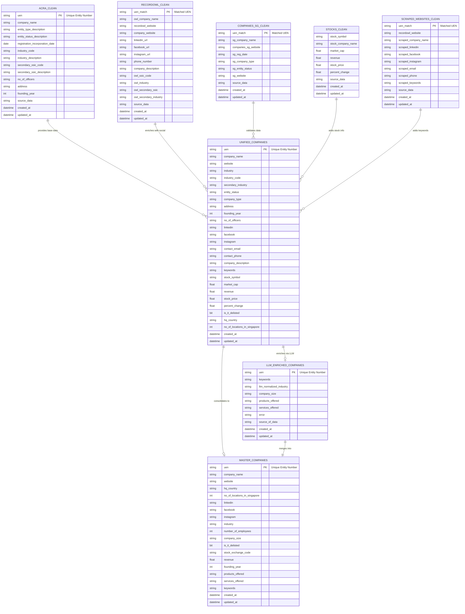

# Entity Relationship Diagram - Singapore Companies DB

## Database Schema Overview

This diagram shows the relationships between tables in the Silver and Gold layers.

---

## ER Diagram (Mermaid)



---

## Table Relationships Explained

### Silver Layer (Data Sources)

1. **acra_clean** (Primary/Base)
   - Main source of company registration data
   - Contains UEN (Unique Entity Number) - primary key
   - Provides: company names, registration dates, industry codes, addresses

2. **recordowl_clean** (Social Media & Websites)
   - Links via UEN matching
   - Provides: websites, LinkedIn, Facebook, Instagram, phone numbers

3. **companies_sg_clean** (Validation)
   - Links via UEN matching
   - Used for validating company data and finding duplicates

4. **stocks_clean** (Financial Data)
   - Matched via fuzzy matching with company names
   - Provides: stock symbols, market cap, revenue, stock prices

5. **scraped_websites_clean** (Additional Info)
   - Links via UEN matching
   - Provides: keywords, additional social media, emails

6. **unified_companies** (Master Silver Table)
   - Consolidates all 5 sources above
   - One record per UEN
   - Ready for gold layer processing

### Gold Layer (Enriched Data)

1. **llm_enriched_companies** (LLM Processing)
   - Generated from unified_companies
   - LLM extracts: normalized industry, company size, products/services
   - Links via UEN (one-to-one with unified_companies)

2. **master_companies** (Final Output)
   - Merges unified_companies + llm_enriched_companies
   - Complete company profile with all data
   - Analytics-ready for reporting

---

## Data Flow Summary

```
ACRA (100K+)  ──┐
RecordOwl     ──┤
Companies.sg  ──┼──> UNIFIED_COMPANIES ──┬──> LLM_ENRICHED ──┐
Stocks        ──┤                          │                   │
Websites      ──┘                          └──────────────────┼──> MASTER_COMPANIES
                                                               │        (GOLD)
                                                               │
                                               (Merge via UEN) ┘
```

---

## Key Relationships

| From Table | To Table | Relationship | Key |
|------------|----------|--------------|-----|
| acra_clean | unified_companies | One-to-One | uen |
| recordowl_clean | unified_companies | One-to-One | uen_match → uen |
| companies_sg_clean | unified_companies | One-to-One | uen_match → uen |
| stocks_clean | unified_companies | Many-to-One | fuzzy match on company_name |
| scraped_websites_clean | unified_companies | One-to-One | uen_match → uen |
| unified_companies | llm_enriched_companies | One-to-One | uen |
| unified_companies + llm_enriched | master_companies | One-to-One | uen |

---

## Notes

1. **Primary Key**: `uen` (Unique Entity Number) - Singapore's official business identifier
2. **Matching Strategy**: 
   - UEN matching for ACRA, RecordOwl, Companies.sg, Websites
   - Fuzzy matching for Stocks (by company name)
3. **Data Quality**: unified_companies performs deduplication and null handling
4. **CDC Tracking**: All tables have `updated_at` for incremental loading
5. **Final Output**: master_companies contains ~10K-50K enriched company records

---

## Schema Versions

- **Silver Layer**: Cleaned and normalized data
- **Gold Layer**: Business-ready enriched data
- **Version**: 1.0.0
- **Last Updated**: November 2024
